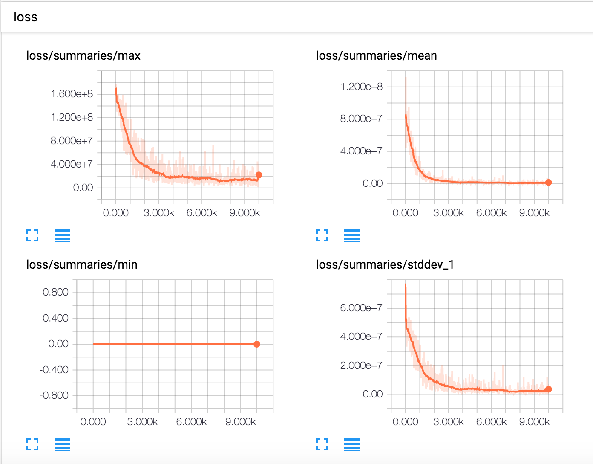
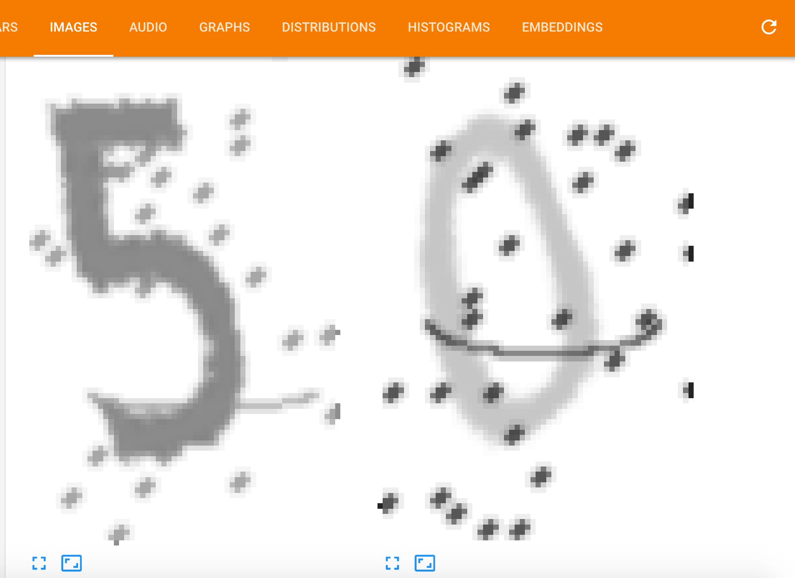
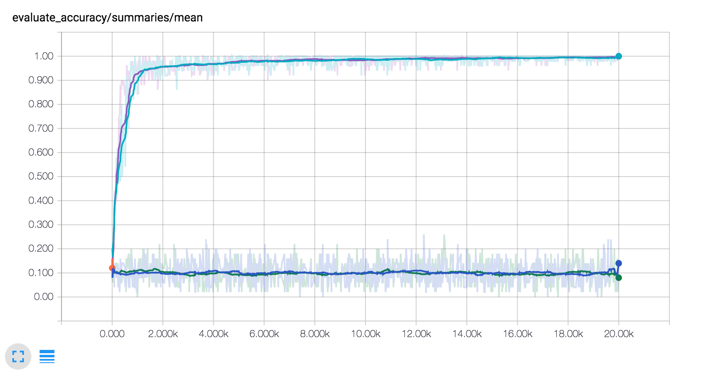
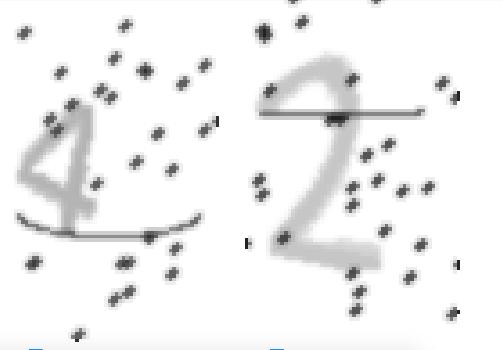
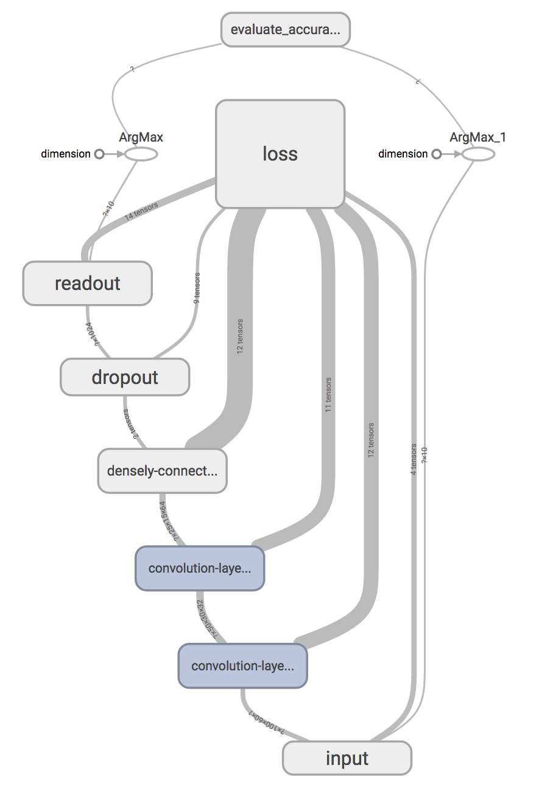
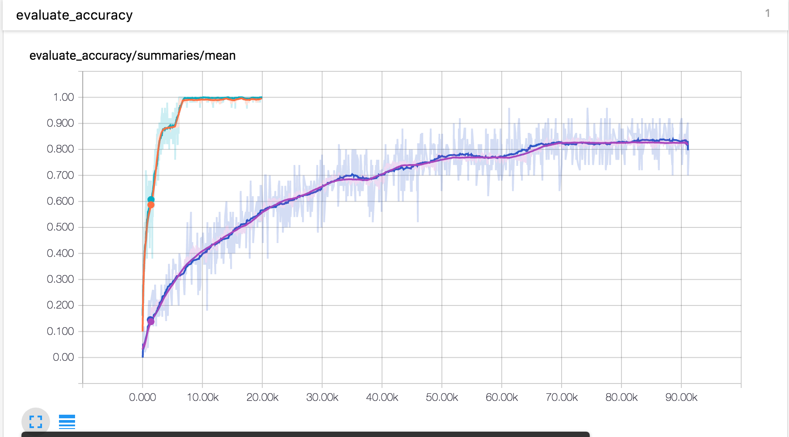
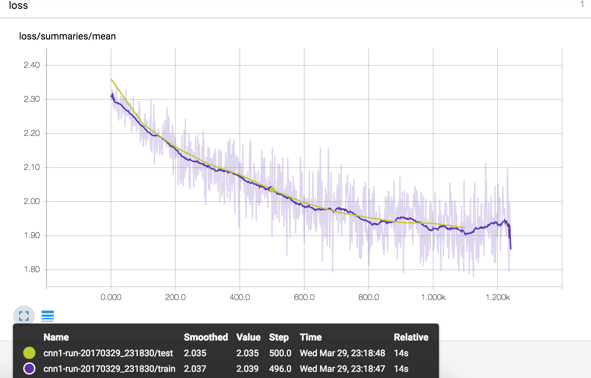

# captcha-tensorflow

使用 tensorflow 做验证码识别

## 训练数据

每一个 dataset 分 train 和 test 2 个目录存放图片数据。
根目录下的 meta.json 存放参数信息。

meta.json 的例子

```javascript
{
    "num_per_image": 1,
    "n_train": 1,
    "label_choices": "0123456789",
    "n_test": 1,
    "width": 60,
    "height": 100,
    "label_size": 10
}
```

图片的例子


#### 生成

使用 python 的 captcha package 生成测试数据

查看用法说明

```bash
$ python gen_captcha.py -h
usage: gen_captcha.py [-h] [-n N] [-t T] [-d] [-l] [-u] [--npi NPI]

optional arguments:
  -h, --help   show this help message and exit
  -n N         number of captchas permutations
  -t T         ratio of test / train.
  -d, --digit  use digits in labels.
  -l, --lower  use lowercase characters in labels.
  -u, --upper  use uppercase characters in labels.
  --npi NPI    number of characters per image.
```

例如，生成包含数字 + 小写字母的验证码，每张图片包含 2 个字符，
10 组训练数据，另外生成 10% 的测试数据

```bash
$ python gen_captcha.py -dl --npi 2 -n 10 -t 0.1
36 choices: 0123456789abcdefghijklmnopqrstuvwxyz
generating 10 groups of captchas in images/char-2-groups-10/train
generating 1 groups of captchas in images/char-2-groups-10/test
write meta info in images/char-2-groups-10/meta.json
```

用时约 1 min。生成的图片数量如下

```bash
$ ls images/char-2-groups-10/train | wc -l
   12600
$ ls images/char-2-groups-10/test/ | wc -l
    1260
```


## 1 个字符的验证码识别


#### Simple-softmax: 1 个字符，1 个 softmax 层，正确率 90%

生成测试数据, 1000 组, 纯数字

```bash
$ python gen_captcha.py -n 1000 -d
```

训练

```bash
$ time python simple_softmax.py
data loaded
train images: 10000. test images: 2000
label_size: 10, image_size: 6000
...
step = 9100, accuracy = 91.10%
step = 9200, accuracy = 91.40%
step = 9300, accuracy = 92.00%
step = 9400, accuracy = 91.40%
step = 9500, accuracy = 91.35%
step = 9600, accuracy = 90.80%
step = 9700, accuracy = 91.60%
step = 9800, accuracy = 91.65%
step = 9900, accuracy = 90.50%
testing accuracy = 91.05%

real2m46.478s
user2m29.704s
sys0m17.828s
```


#### tensorboard


基本的原理：

tensorflow 执行时，写 log 文件，
tensorboard 解析 log 并做数据可视化。

定义 graph 的时候，
用 tf.summary 定义需要写入日志的变量值和格式。

代码：`softmax_with_log.py`


```bash
$ python softmax_with_log.py
```

在另外 1 个 terminal 中执行

```bash
$ tensorboard --logdir=log
```

浏览器中打开 `http://127.0.0.1:6006/`






#### 2 层 Convolutional 网络: 正确率 10%

作为对比，在 mnist 数据集上，跑出了 98%+ 的正确率。

在验证码的数据集上，基本在 10% 左右 -- 恰好等于随机蒙的概率。




#### 神奇的调参，2 层 Convolutional，正确率 99%


同样 1 个数据集，softmax 正确率 90%，
加了 CNN 却降到了 10% -- 随机蒙的概率。
2 者的数据集相同，不会是数据源的问题。

mnist tutorial 里的 convolutional.py 模型，正确率 98%，
数据源换成验证码以后，也是 10%。
模型相同，不是我的低级编码错误导致。

再看一遍数据源和模型




前面的 2 个卷积层，成功的把 feature 全部过滤掉了，留下来的都是噪声的小圆点。

灰度图里，这些小圆点，颜色比信息要深一些。
模型的 pooling 是 max，激活是 ReLU，正好提取了小圆点。
导致最后一层全链接学习不到正确的参数。

人工智能里的 Bug 也更加智能了

所以，是不是可以搞一个验证码生成与识别的 AI 对抗。

把纯数字的改成了英文+数字混合( 36 labels )，训练了两个小时，正确率收敛在 80% 左右。

调参以后的 accuracy 与 loss 曲线



