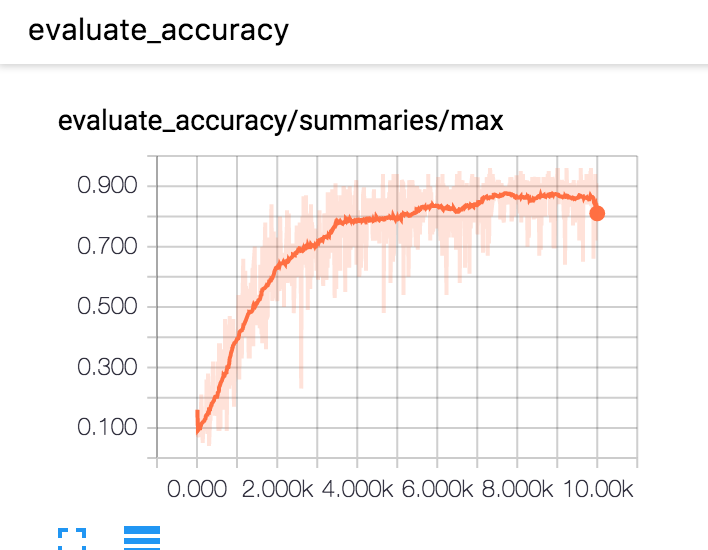

# captcha-tensorflow

使用 tensorflow 做验证码识别


## 1 个字符的验证码识别


#### 生成训练数据

使用 python 的 captcha package 生成测试数据

图片大小为 60 * 100 (width * height)

```bash
$ python gen_capthca.py
generating 1000 captchas in images/one-char/train
generating 200 captchas in images/one-char/test
```

也可以自定义数据规模，
比如：10000 组训练数据，30% 比例的测试数据。

```bash
$ python gen_capthca.py -n 10000 -t 0.3
```


#### Simple-softmax: 1 个字符，1 个 softmax 层，正确率 90%

生成测试数据, 10000 组

```bash
$ python gen_capthca.py -n 10000
generating 10000 captchas in images/one-char/train
generating 2000 captchas in images/one-char/test
```

训练

```bash
$ time python simple_softmax.py
data loaded. train images: 10000. test images: 2000
...
step = 9100, accuracy = 91.10%
step = 9200, accuracy = 91.40%
step = 9300, accuracy = 92.00%
step = 9400, accuracy = 91.40%
step = 9500, accuracy = 91.35%
step = 9600, accuracy = 90.80%
step = 9700, accuracy = 91.60%
step = 9800, accuracy = 91.65%
step = 9900, accuracy = 90.50%
testing accuracy = 91.05%

real2m46.478s
user2m29.704s
sys0m17.828s
```

另外一次运行的输出

```bash
step = 9100, accuracy = 91.19%
step = 9200, accuracy = 90.76%
step = 9300, accuracy = 91.76%
step = 9400, accuracy = 90.39%
step = 9500, accuracy = 64.87%
step = 9600, accuracy = 88.35%
step = 9700, accuracy = 90.64%
step = 9800, accuracy = 91.94%
step = 9900, accuracy = 81.67%
testing accuracy = 91.35%

real2m463m29.769s
user2m293m8.040s
sys0m170m23.968s
```

不仅慢了，而且 accuracy 浮动很大。


#### tensorboard


基本的原理：

tensorflow 执行时，写 log 文件，
tensorboard 解析 log 并做数据可视化。

定义 graph 的时候，
用 tf.summary 定义需要写入日志的变量值和格式。

代码：`softmax_with_log.py`


```bash
$ python softmax_with_log.py
```

在另外 1 个 terminal 中执行

```bash
$ tensorboard --logdir=log
```

浏览器中打开 `http://127.0.0.1:6006/`




